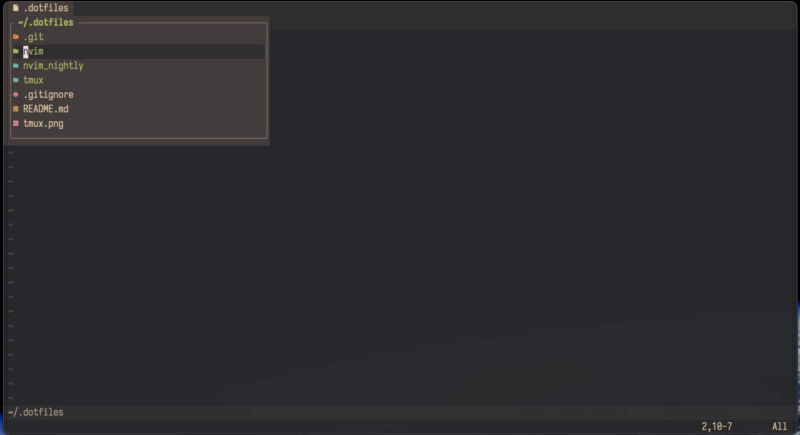
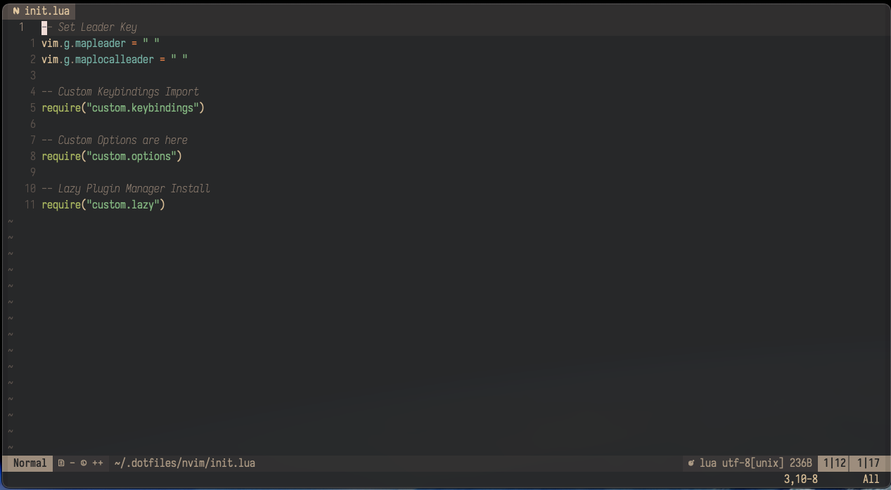

# My dotfile configurations

## Design Principles

1. Keep it simple
2. Focus on top languages I work in
3. Least plugins as possible

> "The worst part about nvim configuration is all the distracting projects that need to be completed."

## Simple Tmux config, no plugins

### Step 1: Use CAPSLOCK as Ctrl

### Step 2: Remap bindings for easy prefix, Ctrl + a (CAPSLOCK + A, easy to each)

```
# Remap prefix from 'C-b' to 'C-a'
unbind C-b
set-option -g prefix C-a
bind-key C-a send-prefix
```

### Step 3: Bindings for [c]reating new window, switching to [n]ext or [p]revious or by [<number>]

```
prefix + c #e.g., CAPSLOCK + a, followed by 'c'
prefix + <#> #Switch to numbered window
prefix + n #Switch to next window
prefix + p #Switch to previous window
prefix + l #Switch to last used window
```

### Tmux Create / Attach / Detatch sessions through shell script

For example, `0: server, 1: nvim, 2: term, 3: git, 4: ai`

### [D]etatch session and attach-session

```bash
# From within a tmux session, prefix + d #Detatch session

tmux attach-session -t $SESSION_NAME
tmux attach-session # Connect with last session
```


## Neovim config





### TODO

- [x] update to latest NeoVim (0.12)
- [x] simplify LSP config, start with Lua Lsp
- [x] python, go, rust lsp and formatters
- [x] React, and Typescript and Tailwind support (if possible)
- [x] autoformat on save
- [x] ~~mini.pick or telescope, maybe mini.pick with core lsp defs~~ mini.files!
- [x] ~~fzf-lua~~ Still using telescope but using it for advance use cases
- [x] blink cmp
- [x] blink cmp, check fuzzy support error
- [x] ~~add OpenCode support~~ Don't need for opencode / ai within nvim
- [ ] do I need this? https://github.com/nvim-lua/plenary.nvim

## Other CLI Tools

- [ ] [Lazygit](https://github.com/jesseduffield/lazygit), beaitifully simple to git
- [ ] [Lazydocker](https://github.com/jesseduffield/lazydocker), lazy way to purge unused containers and images
- [ ] fzf, rg, bat for getter terminal experience
- [ ] iTerm2 because I am lazy to redo everything in kitty or allacrity...
- [ ] [OpenCode](https://opencode.ai/), powerful TUI application to test agents, not just for code generation
