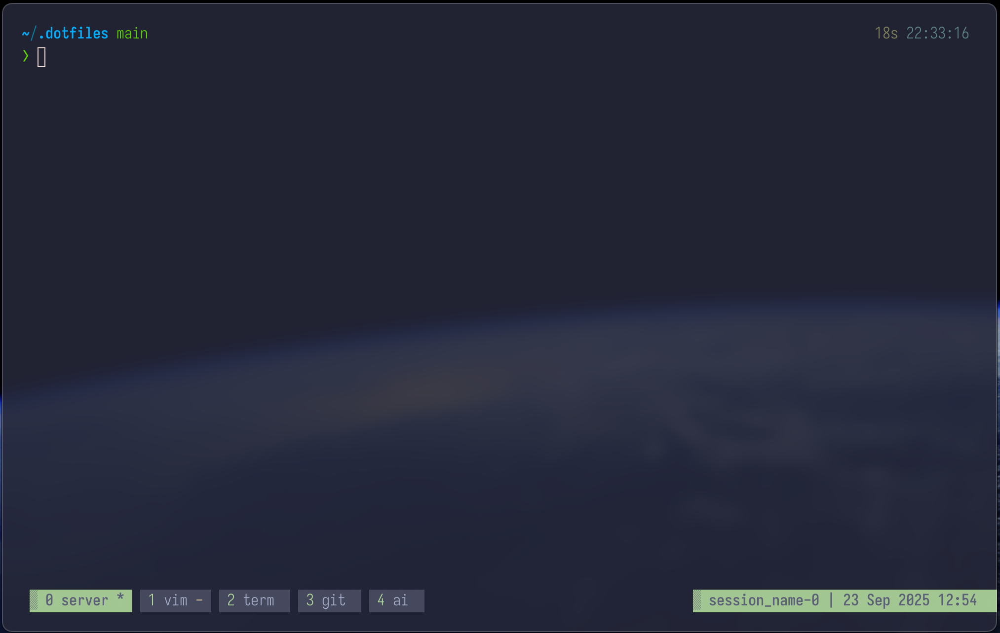

# My dotfile configurations

## Design Principles

1. Keep it simple
2. Focus on top languages I work in
3. Least plugins as possible

## Language priority
1. Python
2. Typescript
3. React
4. CSS (with Tailwind support)

> "The worst part about nvim configuration is all the distracting projects that need to be completed."

## Simple Tmux config, no plugins

### Use CAPSLOCK as Ctrl

### Remap bindings for easy prefix, CAPSLOCK + a

```
# Remap prefix from 'C-b' to 'C-a'
unbind C-b
set-option -g prefix C-a
bind-key C-a send-prefix
```

### [c]reate new window, switch to [n]ext or [p]revious or by [#]

```
prefix + c #e.g., CAPSLOCK + a, followed by 'c'
prefix + <#> #Switch to numbered window
prefix + n #Switch to next window
prefix + p #Switch to previous window
prefix + l #Switch to last used window
```

### Tmux Create / Attach / Detatch sessions

I use my Rust cli tool to create sessions based on folder name with preset windows.

For example, `0: server, 1: nvim, 2: term, 3: git, 4: ai`

### [D]etatch session and attach-session

```bash
# From within a tmux session, prefix + d #Detatch session

tmux attach-session -t $SESSION_NAME
tmux attach-session # Connect with last session
```



## Neovim config

### TODO

- [x] update to latest NeoVim (0.12)
- [x] simplify LSP config, start with Lua Lsp
- [x] python, go, rust lsp and formatters
- [x] React, and Typescript and Tailwind support (if possible)
- [ ] autoformat on save
- [ ] mini.pick or telescope, maybe mini.pick with core lsp defs
- [ ] fzf-lua
- [x] blink cmp
- [x] blink cmp, check fuzzy support error
- [ ] add OpenCode support
- [ ] do I need this? https://github.com/nvim-lua/plenary.nvim
