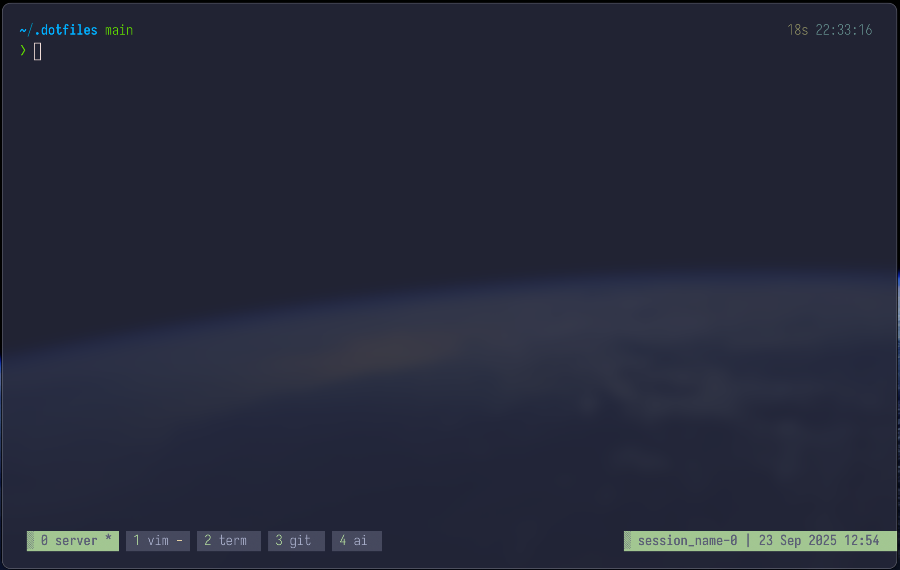
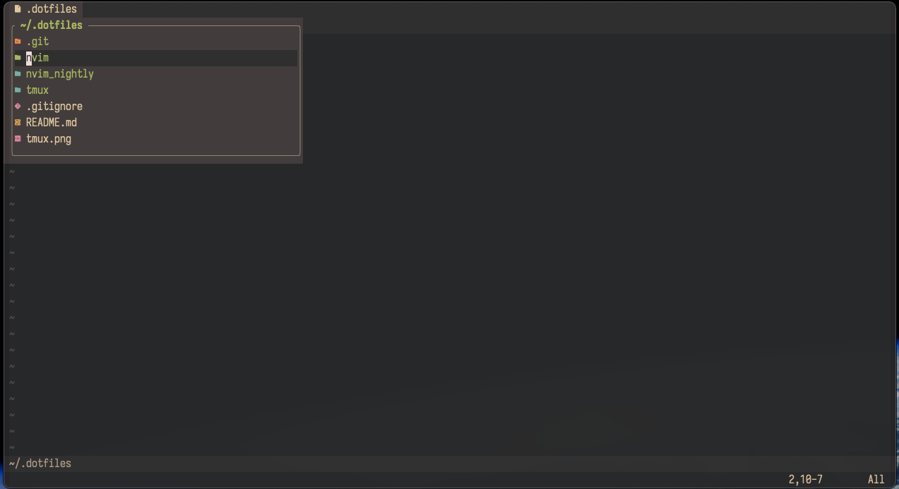
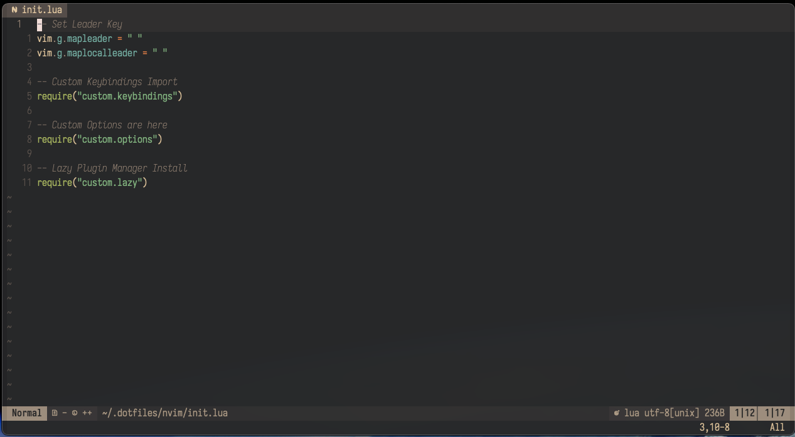

# Dotfile Config

## Design principles

1. Keep it simple
2. Least plugins as possible
3. Working formatters, LSP and autocomplete

## Tmux config, no plugins



### Step 1: Use CAPSLOCK as Ctrl

Setting CAPSLOCK as Crtl is easy on my fingers.

### Step 2: Remap bindings for easy prefix, Ctrl + a (CAPSLOCK + A, easy to each)

With CAPSLOCK as Ctrl, accessing tmux prefix is easy with Ctrl + a

```
# Remap prefix from 'C-b' to 'C-a'
unbind C-b
set-option -g prefix C-a
bind-key C-a send-prefix
```

### Step 3: Bindings for [c]reating new window, switching to [n]ext or [p]revious or by [<number>]

```
prefix + c #e.g., CAPSLOCK + a, followed by 'c'
prefix + <#> #Switch to numbered window
prefix + n #Switch to next window
prefix + p #Switch to previous window
prefix + l #Switch to last used window
```

### Tmux Create / Attach / Detatch sessions through shell script

For example, `0: server, 1: nvim, 2: term, 3: git, 4: ai`

### [D]etatch session and attach-session

```bash
# From within a tmux session, prefix + d #Detatch session

tmux attach-session -t $SESSION_NAME
tmux attach-session # Connect with last session
```

## Neovim config 0.11

Currently using Nvim 0.11.
Tested Nvim 0.12 but abandoned it halfway. I was spending more time configuring nvim than coding.





### TODO

- [x] update to latest NeoVim (0.12), did not use it when I was on nighly
- [x] simplify LSP config, start with Lua Lsp
- [x] python, go, rust lsp and formatters
- [x] React, and Typescript and Tailwind support (if possible)
- [x] autoformat on save
- [x] ~~mini.pick or telescope, maybe mini.pick with core lsp defs~~ mini.files!
- [x] ~~fzf-lua~~ Still using telescope but using it for advance use cases
- [x] blink cmp
- [x] blink cmp, check fuzzy support error
- [x] ~~add OpenCode support~~ Don't need for opencode / ai within nvim
- [ ] do I need this? https://github.com/nvim-lua/plenary.nvim - no need so far

## Tools I use

- [x] iTerm2
- [x] [Lazygit](https://github.com/jesseduffield/lazygit), beaitifully simple way to git
- [x] [Lazydocker](https://github.com/jesseduffield/lazydocker), lazy way to purge unused containers and images
- [x] fzf, rg, jq for getter terminal experience
- [x] [OpenCode](https://opencode.ai/), claude code alternate when CC is down or when testing local on-prem models

### Nvim 0.12 checklist

- [ ] confirm all current settings are working and notice breaking changes
- [ ] treesitter cli?
- [ ] File explorer, mini
- [ ] confirm blink cmp
- [ ] confirm markdown lsp
- [ ] rename config from nvim_nightly to nvim12
- [ ] run with n12 command and then switch to nvim
